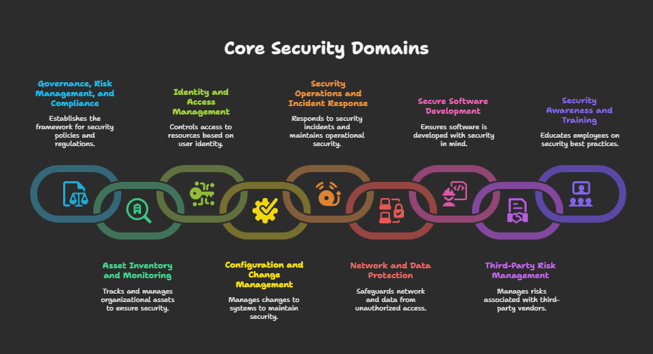
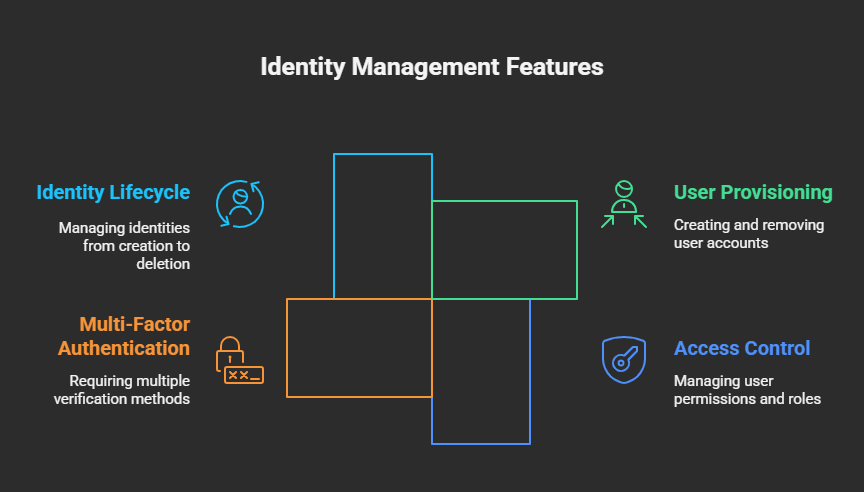
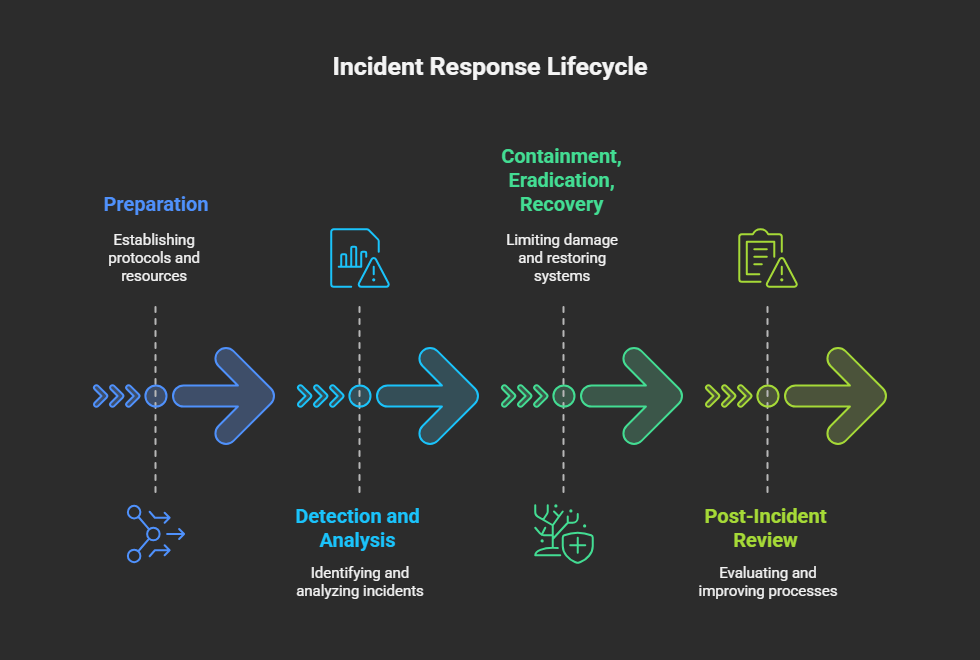

# Information Security & GRC Portfolio

Welcome to my **Information Security / Governance, Risk & Compliance (GRC)** portfolio.
## GRC Framework Overview

This repository showcases a curated collection of projects, frameworks, and best practices  
developed to enhance organizational security posture and ensure regulatory compliance.

Each section reflects practical experience in designing and implementing controls across key domains, including:

- Governance, Risk Management, and Compliance
- Asset Inventory and Monitoring
- Identity and Access Management
- Configuration and Change Management
- Security Operations and Incident Response
- Network and Data Protection
- Secure Software Development
- Third-Party Risk Management
- Security Awareness and Training

The content is aligned with industry standards such as **NIST CSF**, **ISO/IEC 27001**, and **CIS Controls**,  
demonstrating a commitment to cybersecurity maturity, operational resilience, and strategic risk reduction.

---

## Portfolio Contents

# Governance & Risk Management

## Overview
Governance and Risk Management establish the foundation of an organization's cybersecurity posture by defining roles, responsibilities, processes, and controls to manage risks effectively.

## Key Components
- Establishing cybersecurity governance frameworks (e.g., ISO 27001, NIST CSF)
- Defining organizational roles & responsibilities for security
- Risk management lifecycle: identification, analysis, mitigation, monitoring
- Continuous improvement via audits and reviews

## Example Work
- Developed a governance framework aligned with ISO 27001 for a mid-sized company.
- Implemented risk registers and tracked remediation plans.
- Conducted quarterly risk reviews with cross-functional teams.

## Tools & Frameworks
- Risk Management Tools: RiskWatch, Archer, LogicManager
- Frameworks: NIST CSF

## References
- [NIST Cybersecurity Framework](https://www.nist.gov/cyberframework)

# Policies & Procedures

## Overview
Security Policies and Procedures define the rules and guidelines to protect information assets and ensure compliance with legal and regulatory requirements.

## Key Elements
- IT Security Policy
- Acceptable Use Policy 
- Acceptable Use Policy
- Access Control Policy
- Incident Response Procedures
- Data Classification and Handling Policies

## Example Work
- Authored comprehensive cybersecurity policies tailored for a SaaS provider.
- Created procedure documents for incident response and vulnerability management.
- Regularly reviewed and updated policies to comply with evolving standards.

## Best Practices
- Ensure policies are clear, concise, and enforceable.
- Communicate policies effectively across the organization.
- Train staff to understand and adhere to policies.

## References
- [SANS Policy Templates](https://www.sans.org/information-security-policy/)
- [NIST Special Publication 800-53](https://csrc.nist.gov/publications/detail/sp/800-53/rev-5/final)
  
# Risk Assessment

## Overview
Risk Assessment identifies, analyzes, and evaluates risks to an organization's assets to prioritize mitigation efforts.

## Process Steps
1. Asset Identification
2. Threat and Vulnerability Analysis
3. Risk Likelihood and Impact Estimation
4. Risk Prioritization and Reporting

## Example Work
- Led annual risk assessments using quantitative and qualitative methods.
- Created risk heat maps to visualize risk exposure.
- Recommended controls and risk acceptance criteria to senior management.

## Tools & Techniques
- Tools: FAIR, OCTAVE, RiskWatch
- Techniques: SWOT analysis, threat modeling, scenario analysis

## References
- [NIST SP 800-30 Risk Management Guide](https://nvlpubs.nist.gov/nistpubs/Legacy/SP/nistspecialpublication800-30r1.pdf)

# Hardware Asset Inventory & Monitoring

## Overview
Maintaining an accurate inventory and monitoring of hardware assets is critical for asset lifecycle management, vulnerability tracking, and compliance.

## Key Activities
- Asset discovery and inventory management
- Regular hardware audits and updates
- Integration with monitoring tools for real-time status

## Example Work
- Implemented automated hardware asset discovery using Pulseway.
- Established procedures for periodic physical audits.
- Integrated asset data with vulnerability management systems.

## Tools & Technologies
- Microsoft SCCM
- Pulseeway

## References
- [NIST SP 800-128 Guide](https://csrc.nist.gov/publications/detail/sp/800-128/final)

# Software Inventory & Monitoring

## Overview
Accurate software inventory and monitoring help prevent unauthorized software use, detect vulnerabilities, and ensure license compliance.

## Key Activities
- Discover and maintain software inventories
- Monitor software versions and patch status
- Enforce software usage policies

## Example Work
- Deployed software inventory tools to track application versions.
- Automated patch status reporting and compliance checks.
- Collaborated with procurement to manage license entitlements.

## Tools & Technologies
- Microsoft SCCM, Pulseway

## References
- [NIST SP 800-40](https://nvlpubs.nist.gov/nistpubs/SpecialPublications/NIST.SP.800-40r4.pdf)

# Identity & Access Management

## Overview
Identity Management ensures that users and devices are properly identified, authenticated, and authorized to access resources.

## Key Elements
- User provisioning and deprovisioning
- Access control and role management
- Multi-factor authentication (MFA)
- Identity lifecycle management

## 🔐 Identity & Access Management Diagram

## Example Work
- Implemented centralized identity management with Active Directory and Azure AD.
- Rolled out MFA across critical systems.
- Established role-based access control (RBAC) policies.

## Tools & Technologies
- Microsoft Active Directory, Azure AD, Okta, Ping Identity

## References
- [NIST SP 800-63](https://pages.nist.gov/800-63-3/)

# Configuration & Change Management

## Overview
Configuration and Change Management controls changes to IT systems to minimize risks and maintain system integrity.

## Key Components
- Change request and approval workflows
- Configuration baseline and documentation
- Monitoring and auditing changes

## Example Work
- Established change advisory board (CAB) procedures.
- Documented baseline configurations for critical servers.
- Automated configuration audits and alerts.

## Tools & Technologies
- ServiceNow, Jira, FreshService 

## References
- [ITIL Change Management](https://www.axelos.com/best-practice-solutions/itil)

# Audit Logging & Monitoring

## Overview
Audit logging and monitoring detect security events, support investigations, and meet compliance requirements.

## Key Activities
- Enable comprehensive logging on critical systems
- Centralize logs in a Security Information and Event Management (SIEM) system
- Set up alerting for suspicious activities

## Example Work
- Deployed Splunk for centralized log aggregation.
- Defined alert rules for privilege escalations and login failures.
- Conducted regular log reviews and compliance audits.

## Tools & Technologies
- Splunk, NetwrixAuditor

## References
- [NIST SP 800-92](https://csrc.nist.gov/publications/detail/sp/800-92/final)

# Managed Detection & Response (MDR)

## Overview
MDR services provide continuous monitoring, threat detection, and response capabilities to enhance security posture.

## Key Components
- 24/7 monitoring by security experts
- Threat hunting and incident response
- Integration with existing security infrastructure

## Example Work
- Partnered with MDR provider to enhance detection capabilities.
- Integrated endpoint telemetry with MDR platform.
- Defined escalation and incident handling processes.

## Providers & Tools
- CrowdStrike Falcon Complete

## References
- [Gartner MDR Market Guide](https://www.gartner.com/en/documents/3987445)

# Physical Access Security

## Overview
Physical access controls protect facilities, hardware, and data from unauthorized physical access and tampering.

## Key Measures
- Badge and biometric access systems
- Visitor management and escort policies
- Surveillance cameras and alarms

## Example Work
- Designed multi-layer physical security for data center.
- Implemented biometric authentication for sensitive areas.
- Conducted physical security audits and drills.

## References
- [NIST SP 800-116](https://csrc.nist.gov/publications/detail/sp/800-116/final)

### Malware & Email Protection
# Malware Protection
## Overview
Malware protection employs technologies and best practices to detect, prevent, and respond to malicious software threats.

## Strategies
- Endpoint protection platforms (EPP)
- Regular signature and behavior-based scanning
- User education on phishing and malware risks

## Example Work
- Deployed and managed enterprise-grade EPP solutions.
- Developed malware incident response workflows.
- Conducted phishing simulations and user awareness training.

## Tools
- Microsoft Defender ATP, CrowdStrike, Malwarebytes

## References
- [MITRE ATT&CK Framework](https://attack.mitre.org/)

# Email & Web Protection

## Overview
Email and web security prevent threats such as phishing, malware, and data leakage via email and web traffic.

## Key Controls
- Email filtering and anti-spam
- Web content filtering and URL categorization
- Secure web gateways and sandboxing

## Example Work
- Implemented Proofpoint email security solution.
- Configured web proxies to restrict access to malicious sites.
- Monitored and reported email phishing campaigns.

## Tools
- Proofpoint, Mimecast

## References
- [NIST SP 800-177](https://csrc.nist.gov/publications/detail/sp/800-177/final)

# Network Security & Segmentation

## Overview
Network security controls and segmentation limit the attack surface and contain breaches by isolating critical assets.

## Core Concepts
- Firewalls and VLAN segmentation
- Zero Trust Network Access (ZTNA)
- Network intrusion detection/prevention systems (IDS/IPS)

## Example Work
- Designed network segmentation using firewalls and VLANs.
- Deployed IDS/IPS for real-time threat detection.
- Implemented micro-segmentation in cloud environments.

## Tools
FortiGate appliance, FortiConverter, FortiManager, and FortiAnalyzer

## References
- [NIST SP 800-125](https://nvlpubs.nist.gov/nistpubs/Legacy/SP/nistspecialpublication800-125.pdf)

# Disaster Recovery Plan (DRP)

## Overview
Disaster Recovery Planning ensures that critical systems and data can be restored quickly after an incident.

## Key Elements
- Business impact analysis (BIA)
- Recovery time objectives (RTO) and recovery point objectives (RPO)
- DR plan development, testing, and maintenance

## Example Work
- Developed DR plans for critical business applications.
- Coordinated DR tabletop exercises with cross-functional teams.
- Integrated cloud DR solutions to reduce downtime.

## References
- [NIST SP 800-34](https://nvlpubs.nist.gov/nistpubs/Legacy/SP/nistspecialpublication800-34r1.pdf)

# Backups

## Overview
Backup processes protect data against loss or corruption by maintaining secure copies for restoration.

## Best Practices
- Regular backup schedules and verification
- Offsite and offline backups for resilience
- Encryption and access controls on backup data

## Example Work
- Designed backup strategy using Azure Backup(MABS)
- Automated backup verification and reporting.
- Ensured compliance with retention policies.

## References
- [NIST SP 800-171](https://csrc.nist.gov/publications/detail/sp/800-171/rev-2/final)

### Data Protection
# Data Encryption

## Overview
Encryption protects data confidentiality both at rest and in transit, safeguarding against unauthorized access.

## Techniques
- Full disk encryption
- Database and file-level encryption
- TLS for network traffic

## Example Work
- Implemented BitLocker for endpoint encryption.
- Encrypted sensitive databases using Transparent Data Encryption (TDE).
- Configured TLS 1.2+ for all internal and external communications.

## References
- [NIST SP 800-57](https://nvlpubs.nist.gov/nistpubs/SpecialPublications/NIST.SP.800-57pt1r5.pdf)

# Data Loss Prevention (DLP)

## Overview
DLP technologies and policies prevent unauthorized data exfiltration and leakage.

## Components
- Content discovery and classification
- Policy enforcement on endpoints, email, and cloud
- Incident response workflows for data leaks

## Example Work
- Deployed DLP solutions to monitor sensitive data.
- Defined policies for PCI and PII data protection.
- Trained users on secure data handling.

## Tools
- Microsoft Purview DLP

## References
- [NIST SP 800-122](https://nvlpubs.nist.gov/nistpubs/Legacy/SP/nistspecialpublication800-122.pdf)

# Service Provider / Third-Party Monitoring

## Overview
Monitoring third-party service providers ensures they meet security requirements and do not introduce risks.

## Key Activities
- Vendor risk assessments
- Contractual security requirements and SLAs
- Continuous monitoring and audits

## Example Work
- Conducted security due diligence for cloud providers.
- Developed third-party risk management framework.
- Established ongoing vendor monitoring dashboards.

## References
- [NIST SP 800-161](https://nvlpubs.nist.gov/nistpubs/SpecialPublications/NIST.SP.800-161.pdf)

# Security Awareness & Training

## Overview
Security Awareness Training empowers employees to recognize and respond to security threats.

## Program Components
- Phishing simulations
- Regular training sessions and assessments
- Policy education and best practices

## Example Work
- Designed organization-wide security awareness program.
- Conducted monthly phishing simulations with reporting.
- Improved security culture and reduced incident rates.
## Tools
 - KnowBe4

## References
- [NIST SP 800-50](https://nvlpubs.nist.gov/nistpubs/Legacy/SP/nistspecialpublication800-50.pdf)

# Software & Connected Product Development

## Overview
Secure software development integrates security throughout the software lifecycle to build resilient connected products.

## Key Practices
- Secure coding standards
- Static and dynamic application security testing (SAST/DAST)
- Threat modeling and code reviews

## Example Work
- Integrated DevSecOps pipelines with automated security testing.
- Led threat modeling workshops for development teams.
- Conducted secure code reviews and vulnerability remediation.

## Tools 
 -   Veracode  
## References
- [OWASP Software Assurance Maturity Model](https://owaspsamm.org/)

# Incident Response

## Overview
Incident Response prepares organizations to detect, analyze, and recover from cybersecurity incidents effectively.

## Incident Response Lifecycle
- Preparation
- Detection and Analysis
- Containment, Eradication, Recovery
- Post-Incident Review
  
## 📊 Incident Response Diagram

## Example Work
- Developed and tested incident response plans.
- Led incident investigations and coordinated remediation.
- Conducted lessons learned sessions to improve readiness.

## References
- [NIST SP 800-61](https://nvlpubs.nist.gov/nistpubs/SpecialPublications/NIST.SP.800-61r2.pdf)

---

Thank you for reviewing my portfolio!  
Feel free to explore each section to learn more about my work and expertise.

